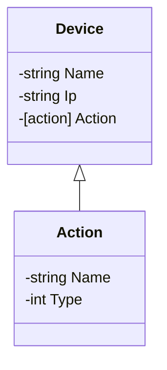

# Devices
A golang server to manage devices.

> Part of [goHome](https://www.github.com/CabraKill/goHome/) project

### Features

Like a REST api with a no-sql database, it has operations like GET, POST and DELETE using the corresponding  HTTP method.

* GET: Returns the list of devices.

* POST: Adds a device to the database. 

	* > If a device with same Ip and Name existings the operation overrides it.

* DELETE: Deletes a device with same Ip and Name if exists.

### Database

The current need of the database is managing the devices while the server is operating. Since the data infrastruct is horizontal with all its properties, a json list is implemented to work as the database.

### Updates

Next incoming updates for this server.

* Concurrency: 
  * It is one of the most important features to have added in a server.